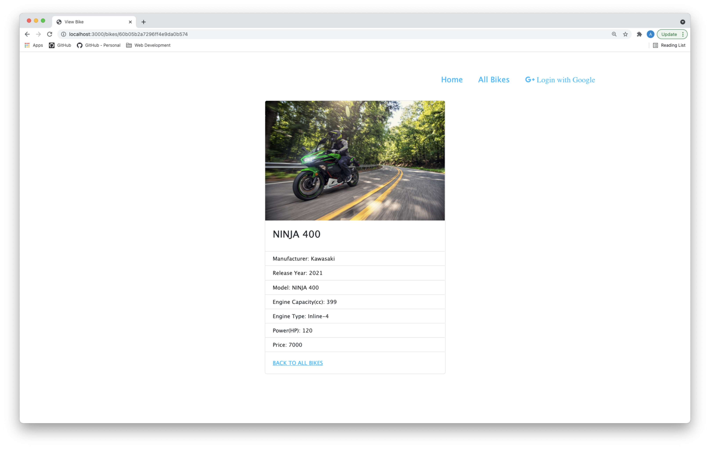
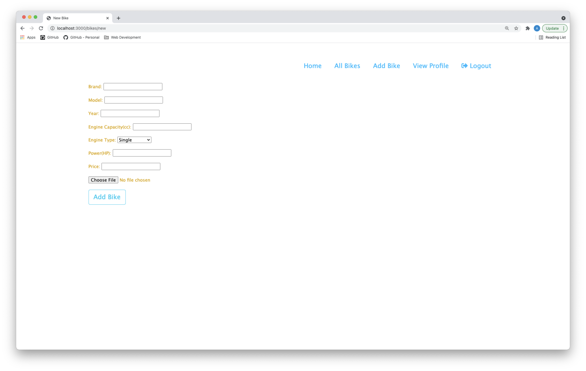

# SEI-FLEX-38 PROJECT - 2


# Book My Ride - Full-Stack CRUD App

### This is Full-Stack CRUD booking system. Where logged in user can view/updated/add/delete bikes. Logged in user can view thier profile and book an appointment for test drive. User can view bikes without loggin in.

---

- Site : [Book My Ride](https://book-my-ride-sei.herokuapp.com/)
- GitHub : [Book My Ride](https://github.com/ar021/Book-my-ride)
- Technologies used : HTML, CSS, JavaScript, Bootstrap, Cloudinary, MongoDB, Express.js, Node.js
- Intial Setup :
    -   Install Dependencies
    ```
    npm install
    ```
    - Set up Google Cloud Platform for oAuth
    - Set up cloudinary for img Database
    - Add Enviorment Variables
    ```
    DATABASE_URL=<...database>
    GOOGLE_CLIENT_ID=<...from Google Cloud Platform>
    GOOGLE_SECRET=<...from Google Cloud Platform>
    GOOGLE_CALLBACK=<...from Google Cloud Platform>
    CLOUDINARY_URL=<...from Cloudinary>
    CLOUD_NAME=<...from Cloudinary>
    
    API_KEY=<...from Cloudinary>
    API_SECRET=<...from Cloudinary>

    SESSION_SECRET=<...your own>
    ```
    - Development Runtime
    ```
    npm run dev
    ```
- Screenshots :








---

## Challenges Faced

- Working with complex ERD
- Implementing cloudinary for img storage
- Implementing oAuth 
- Writing Scoring Row function

---

## Key Learings

- How to do a restful route
- How to performe CRUD
- How to do oAuth
- How to integrate Database
- How to have img input...list goes on

---

## Future Goals

Stage 1
- Implementing Booking Model
- Polishing UI
- Cleaning up the Code

Stage 2
- Implementing Power User
- Provide user booking confirmation
- Implementing Google Map api
